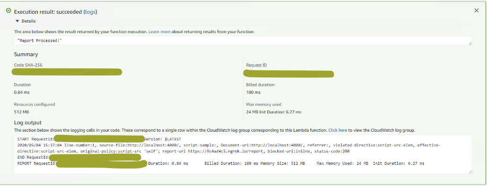

# CSP-Listener-via-AWS-Lambda
CSP Listenere is a server which logs all CSP violations and is an ideal candidate to run on an AWS Lambda platform, primarily because it doesn't need to be active all the time and can be activated based on the endpoint triggerring.

# Working
Here it would listen to the handler event on the lambda and convert the JSON request to the structure defined and parse the request appropriately.
The values of the JSON are processed correctly and logged on to the console and a response of "Report Processed!"

# Output


# Complie the program
GOOS=linux go build -a -o main 

# Zip the function
zip function.zip main

# Use AWS CLI or UI to upload the function.zip to lambda and then use API gateway or some sort of forwarder to this.

# To test create a payload as follows
```{
  "csp-report": {
    "document-uri": "http://localhost:4000/",
    "referrer": "",
    "violated-directive": "script-src-elem",
    "effective-directive": "script-src-elem",
    "original-policy": "script-src 'self'; report-uri https://localhost/report",
    "disposition": "report",
    "blocked-uri": "inline",
    "line-number": 1,
    "source-file": "http://localhost:4000/",
    "status-code": 200,
    "script-sample": ""
  }
}```

